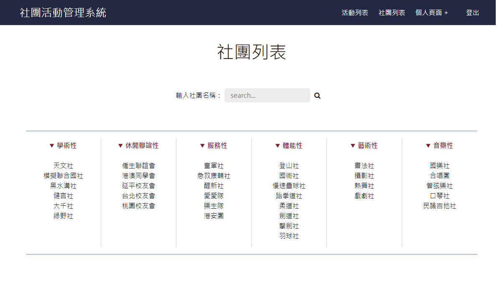
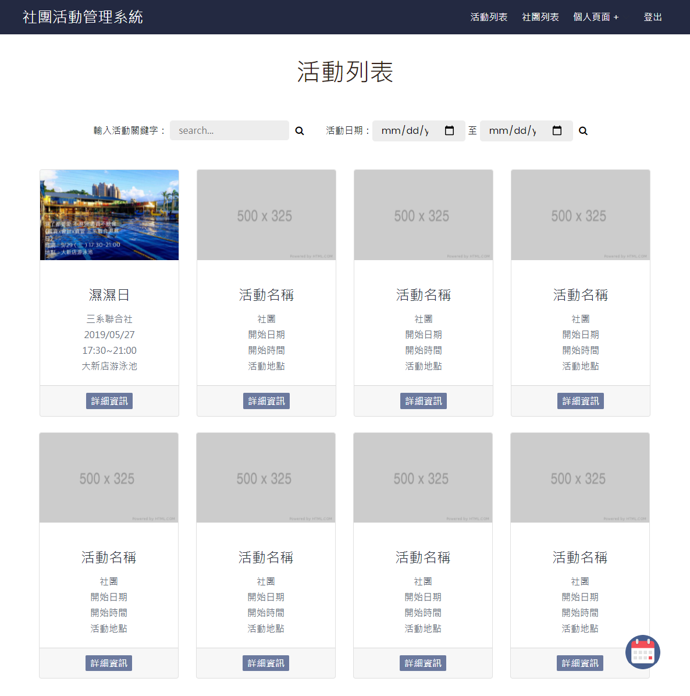
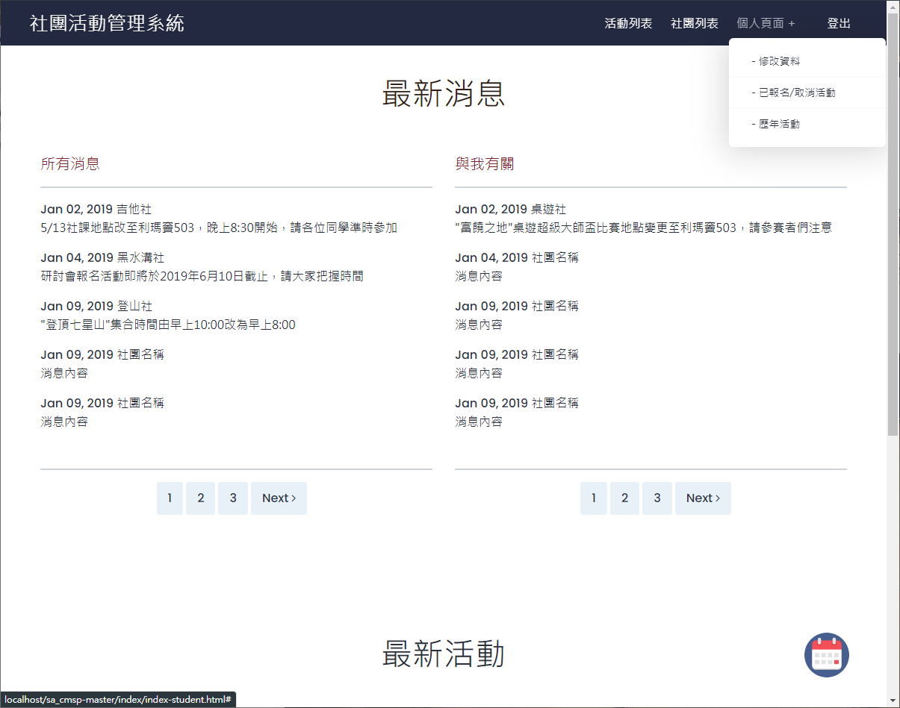
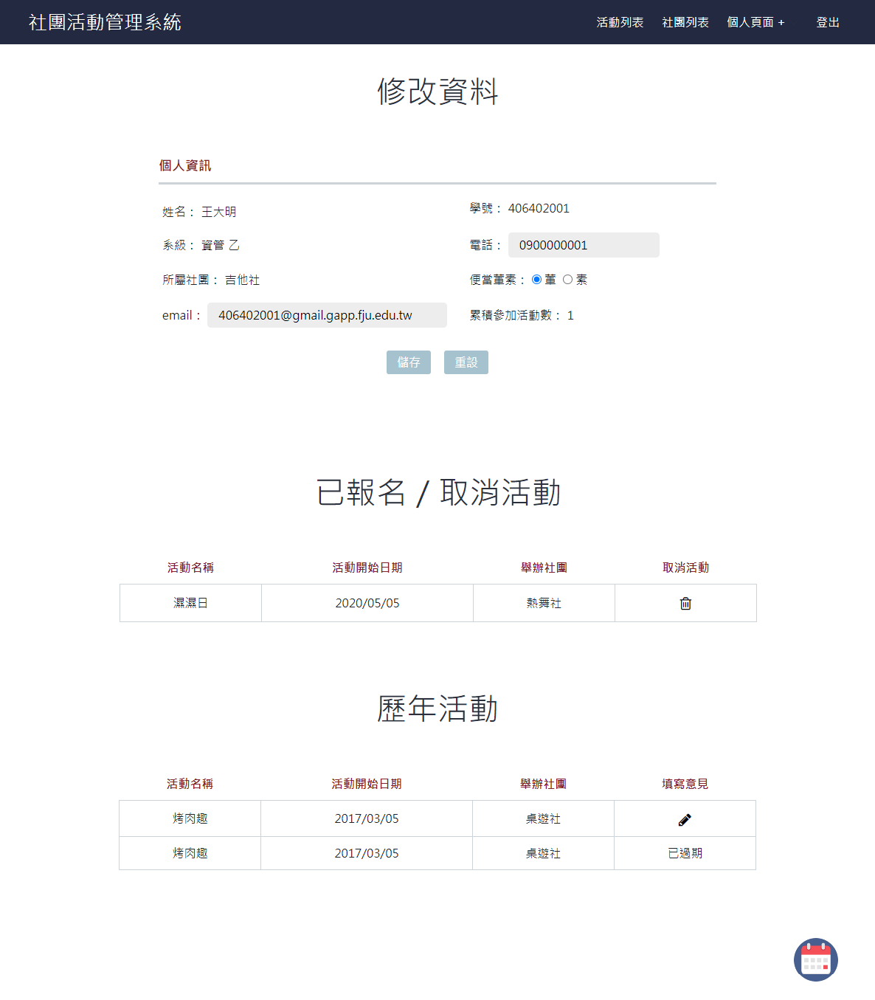
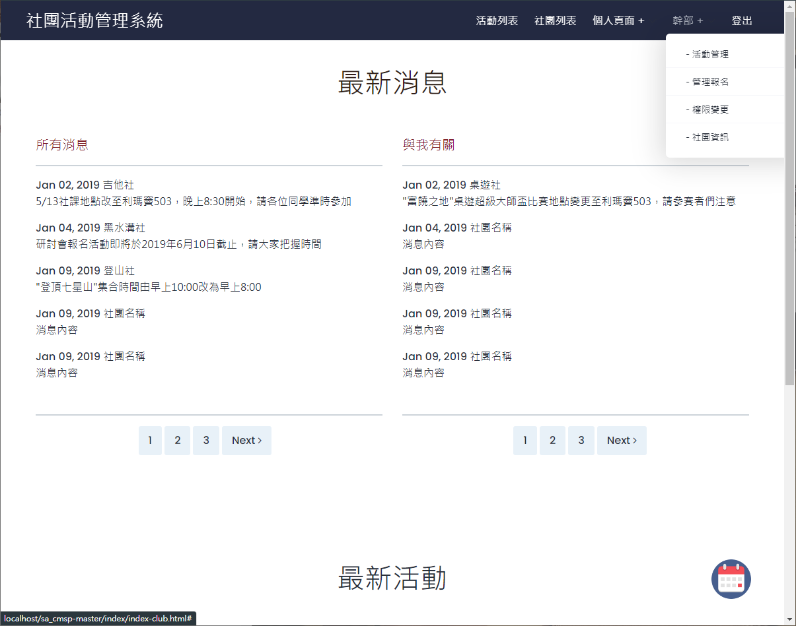
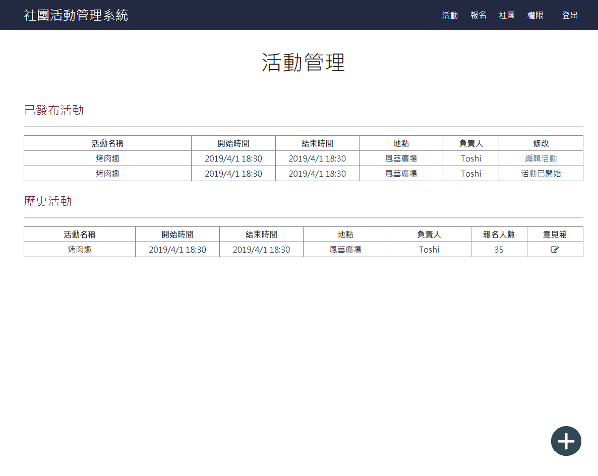
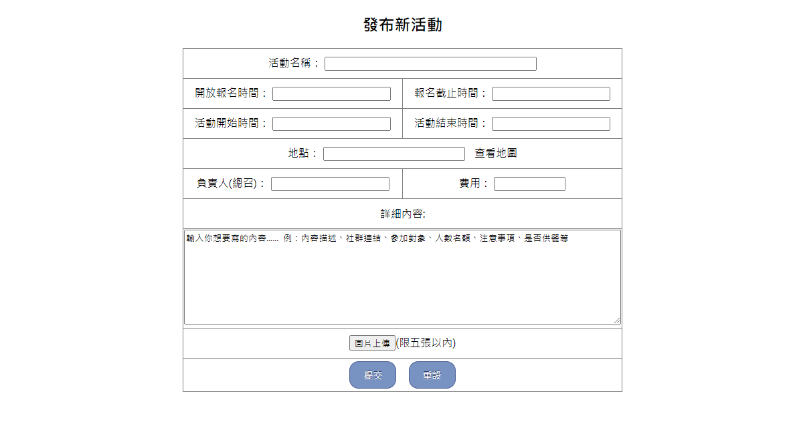
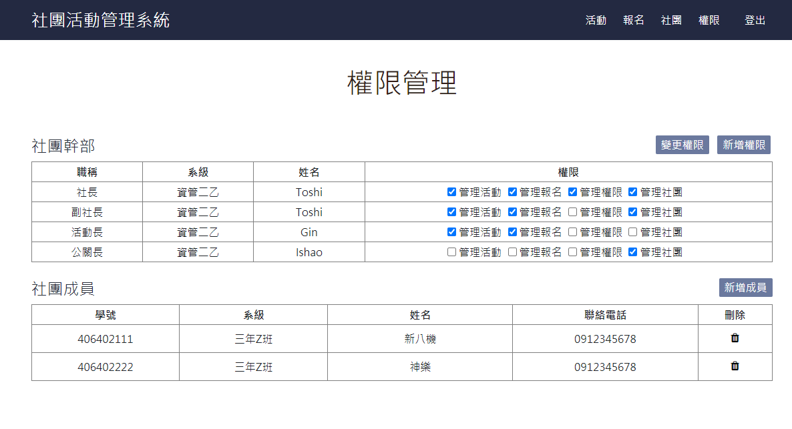
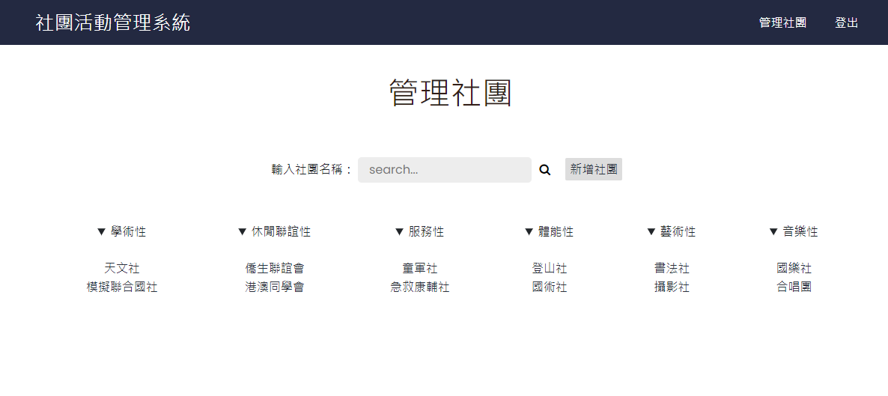
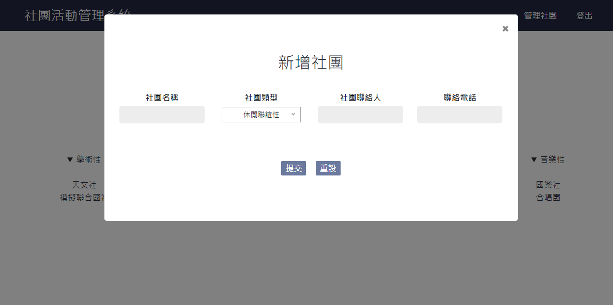

# 社團管理系統 School Club 

此專案為大學社團管理系統，目的在於將社團流程線上化，學生可依身分類別不同(有無社團、是不是社團幹部)增加使用不同功能，教師也可以線上管理社團

使用HTML、PHP、CSS撰寫，配合RDBMS資料庫

## 功能

學生

* 查看社團列表

* 查看活動列表

* 修改個人資料

* 報名/取消活動

* 歷年活動

社團幹部

* 上述學生基本功能

* 活動管理

* 管理活動報名

* 社團成員權限

* 社團基本資料

教師

* 管理社團

## 介面

單一入口登入頁面 (判斷登入者身分)

社團列表

活動列表

### 學生

學生首頁 (不含社團幹部身分)

修改基本資料、報名/取消活動、查看歷年活動

### 社團幹部 

學生首頁 (含社團幹部)

社團活動管理

社團成員權限

### 教師

管理社團

增加社團

